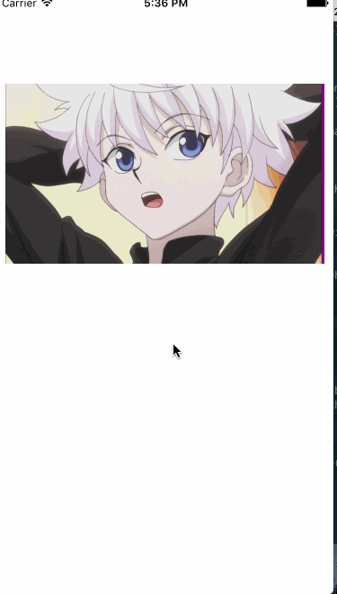

# FoldingDemo
折叠效果demo，可设置上下折叠和左右折叠
# 用法
        self.foldingView = FoldIngView(frame: CGRect(x: 10, y: 100, width: Int(ScreenWidth - 20), height: Int(IMAGE_PER_HEIGIT * 4)), foldingDirection: .horizontal)
        self.foldingView.backgroundColor = UIColor.purple
        self.view.addSubview(self.foldingView)
# 图示

